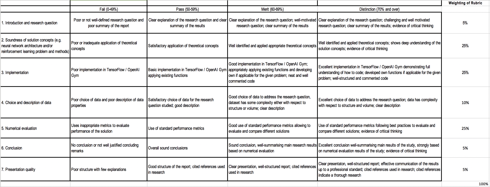

# ST449 Course Project

 

This is the repository for the course project – please keep anything project related in this repository.

 

**Project Deadline: 30th April 2020, 5 pm London time.**

 
## Candidate Number: 35661
 

## Project title: 

 
Music Genre Recognition using Neural Networks

 

## Summary:

 
First i plan to convert the audio file into a suitable format, then use various neural network architextures and compare their performance.
The data set that I will be useing has 8 genres and 1000 songs per genre evenly distributed. The eight genres are Electronic, Experimental, Folk, Hip-Hop, Instrumental, International, Pop and Rock.

 

## References

 

Dataset found here: https://github.com/mdeff/fma
These papers look at a similar task using a different dataset.

http://cs229.stanford.edu/proj2011/HaggbladeHongKao-MusicGenreClassification.pdf

https://ccneuro.org/2018/proceedings/1153.pdf

https://pdfs.semanticscholar.org/4ccb/0d37c69200dc63d1f757eafb36ef4853c178.pdf

## Notes

* [MV 30 March 2020] Approved. 

---

## Marking criteria

 

## Candidate topics

[Project.md](https://github.com/lse-st446/lectures2020/blob/master/Projects.md)

 
